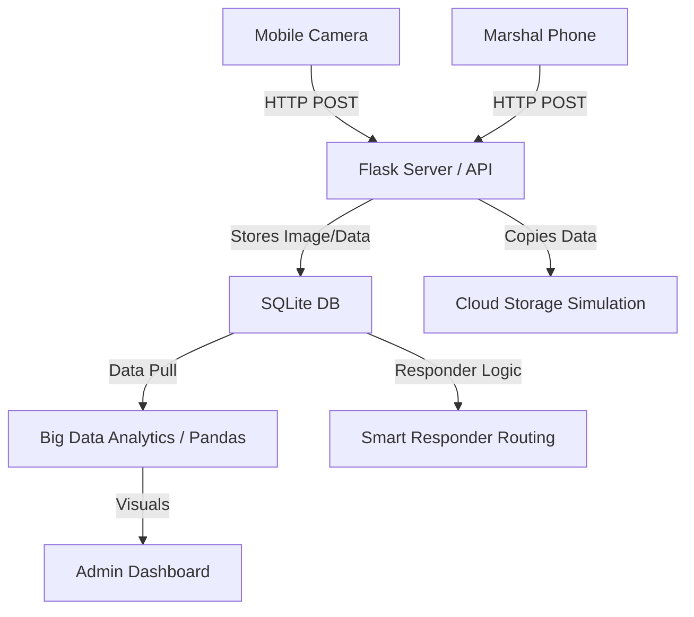

# CrowdCare - Real-Time Crowd Density Monitoring

**CrowdCare** is a prototype college demonstration project illustrating Cloud Computing and Big Data Analytics concepts through a real-time crowd monitoring and incident response system. 

## Project Features
- **Mobile Data Collection**: Mobile devices capture images to estimate crowd counts.
- **Incident Reporting & Smart Routing**: Marshals report incidents, and the system uses the Haversine formula to assign the nearest available responder.
- **Cloud Storage Simulation**: Explains how generated data can be stored securely in the cloud.
- **Big Data Analytics**: Simulates 40 software zones and processes up to 100,000 records to show Volume, Velocity, Variety, Veracity, and Value (the 5Vs of Big Data).
- **Admin Dashboard**: Visualizes live density with Chart.js and Leaflet/OpenStreetMap.

## Installation & Setup
1. Clone or download the repository.
2. Install required Python packages:
   ```bash
   pip install -r requirements.txt
   ```
3. Run the Flask application:
   ```bash
   python app.py
   ```
4. Access the Dashboard: `http://127.0.0.1:5000`
5. Access Mobile Camera: `http://<YOUR-LAPTOP-IP>:5000/camera`

## Default Credentials
- **Admin**: `admin` / `admin123`
- **Marshal**: `marshal` / `marshal123`
- **Responder**: `responder` / `responder123`

## Architecture Diagram (Simplified)


## Note for Evaluators
- This is a *prototype*. ML crowd estimation (CSRNet) is simulated using OpenCV edge detection and random distribution.
- The 40 cameras are *software simulated* to generate sufficient data for the Big Data analytics demonstration.
- The cloud storage is simulated locally under the `cloud_storage` folder to demonstrate the concept without requiring paid credentials.
