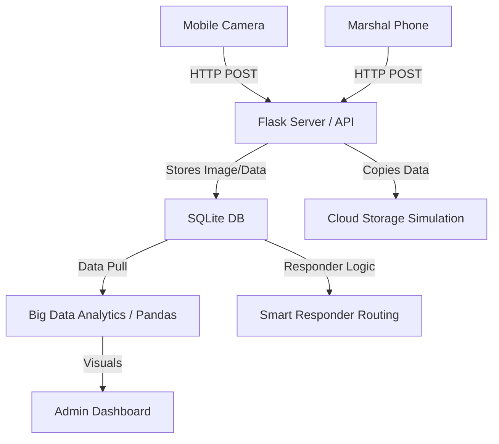

# CrowdCare - Real-Time Crowd Density Monitoring

**CrowdCare** is a prototype college demonstration project illustrating Cloud Computing and Big Data Analytics concepts through a real-time crowd monitoring and incident response system.

## Project Purpose
This is a course demonstration project for:
1. **Cloud Computing** - Demonstrates client-server architecture, cloud storage simulation, and network data accessibility
2. **Big Data Analytics** - Demonstrates the 5Vs of Big Data (Volume, Velocity, Variety, Veracity, Value) through large-scale data processing

## Project Features
- **Mobile Data Collection**: Mobile devices capture images to estimate crowd counts using OpenCV-based prototype crowd estimation
- **Incident Reporting & Smart Routing**: Marshals report incidents, and the system uses the Haversine formula to assign the nearest available responder
- **Cloud Storage Simulation**: Demonstrates how data would be stored in cloud services like AWS S3, Azure Blob Storage, or Google Cloud Storage
- **Big Data Analytics**: Simulates 40 software zones and processes up to 100,000 records to show the 5Vs of Big Data
- **Admin Dashboard**: Visualizes live density with Chart.js and Leaflet/OpenStreetMap with auto-refresh every 5 seconds
- **40-Zone Simulation**: Software-simulated zones for demonstrating big data concepts without requiring 40 physical cameras

## Installation & Setup

### Prerequisites
- Python 3.8 or higher
- pip (Python package manager)

### Step 1: Install Dependencies
```bash
cd CrowdCare
pip install -r requirements.txt
```

### Step 2: Run the Application
```bash
python app.py
```

The application will start on:
- **Local access**: `http://127.0.0.1:5000`
- **Network access**: `http://<YOUR-LAPTOP-IP>:5000`

### Step 3: Access from Mobile Devices
For Android phones to access the camera and marshal interfaces:
1. Ensure your phone and laptop are on the same Wi-Fi network
2. Find your laptop's IP address (shown when you run the app)
3. On your phone, access: `http://<YOUR-LAPTOP-IP>:5000/camera`

## Default Credentials
- **Admin**: `admin` / `admin123` - Full access to dashboard, events, zones, incidents, responders
- **Marshal**: `marshal` / `marshal123` - Can report incidents via marshal interface
- **Responder**: `responder` / `responder123` - Can view assigned incidents

## Demonstration Flow

### Step 1: Admin Login
1. Open `http://127.0.0.1:5000`
2. Login with admin credentials
3. You'll see the admin dashboard

### Step 2: Generate 40 Software Zones
1. Go to **Simulation** page
2. Click **"Generate 40 Zones"**
3. This creates coordinate points for the map

### Step 3: Generate Big Data
1. Go to **Big Data Gen** page
2. Click **"Generate 10,000"** or **"Generate 100,000"** records
3. This demonstrates the **Volume** aspect of Big Data

### Step 4: View Analytics
1. Go to **Analytics** page
2. See charts showing:
   - Top 10 crowded zones
   - Density distribution
   - Simple crowd prediction
3. This demonstrates the **Value** aspect of Big Data

### Step 5: Test Camera (Optional - requires camera access)
1. Open `http://<YOUR-LAPTOP-IP>:5000/camera` on your phone or laptop
2. Grant camera permissions
3. Click **"Start Live AI"** to capture and analyze crowd images
4. The system uses OpenCV-based prototype crowd estimation
5. Set different thresholds to test density levels

### Step 6: Test Incident Reporting
1. Login as **Marshal** (`marshal` / `marshal123`)
2. Go to **Marshal Dashboard**
3. Report an incident (e.g., "Overcrowding")
4. System automatically finds nearest responder using Haversine formula
5. View assigned responder on dashboard

### Step 7: View Cloud Storage Simulation
1. Go to **Cloud Storage Sim** page
2. See statistics about data stored in simulated cloud storage
3. Go to **Cloud Concepts** page to understand the architecture

### Step 8: Understand Big Data Concepts
1. Go to **Big Data Concepts** page
2. See explanation of the 5Vs of Big Data in the context of CrowdCare

## Architecture Diagram


## Technology Stack

### Frontend
- **HTML5, CSS3, Bootstrap 5** - UI framework
- **Vanilla JavaScript** - Client-side logic
- **Chart.js** - Data visualization
- **Leaflet + OpenStreetMap** - Interactive maps

### Backend
- **Python** - Programming language
- **Flask** - Web framework
- **SQLite** - Database

### Data Processing
- **Pandas** - Data manipulation and analysis
- **NumPy** - Numerical computing
- **OpenCV** - Image processing for prototype crowd estimation
- **Scikit-learn** - Machine learning utilities (optional)

## What is Real vs Simulated

### Real Working Features
✅ **User authentication** with role-based access control
✅ **Incident reporting** and **smart responder routing** using Haversine formula
✅ **40-zone simulation** with realistic coordinates
✅ **Big data generation** (up to 100,000 records)
✅ **Analytics dashboard** with real charts and statistics
✅ **Cloud storage simulation** with actual file storage
✅ **Map visualization** with real-time updates
✅ **Database operations** with SQLite

### Prototype/Simulation Features
🔸 **Crowd estimation** - Uses OpenCV-based prototype methods (edge detection, contour analysis) instead of advanced ML models like CSRNet. This is clearly labeled as "Prototype Crowd Estimation" in the code.
🔸 **40 zones** - Software-simulated rather than requiring 40 physical cameras
🔸 **Cloud storage** - Local simulation folder (`cloud_storage/`) instead of actual AWS S3/Azure Blob Storage
🔸 **Prediction** - Simple moving average instead of complex AI models

## Cloud Computing Concepts Demonstrated

1. **Client-Server Architecture**: Mobile devices (clients) communicate with Flask server
2. **Resource Pooling**: Server can handle multiple camera streams simultaneously
3. **Network Accessibility**: Data accessible from any device on the network
4. **Cloud Storage Simulation**: Demonstrates how data would be stored in cloud services
5. **Scalability**: System designed to handle multiple data sources

## Big Data Concepts Demonstrated (The 5Vs)

1. **Volume**: Can generate up to 100,000 records across 40 zones
2. **Velocity**: Real-time data collection from cameras every 5 seconds
3. **Variety**: Handles images, GPS coordinates, incident reports, and structured data
4. **Veracity**: Data validation and cleaning processes
5. **Value**: Analytics extract actionable insights for crowd safety

## Faculty Explanation Guide

**Mobile devices act as data sources. The Flask server acts as the cloud application layer in our prototype. Crowd, GPS and incident information are continuously collected and stored. We generate large volumes of zone-wise records to demonstrate Big Data processing. Python Pandas and NumPy process the data, and Chart.js visualizes the results. The local cloud-storage simulation represents how the storage layer can later be replaced with an actual cloud service.**

## Troubleshooting

### Camera not working?
- Ensure you've granted camera permissions
- Check if your browser supports camera access
- Try using HTTPS if camera access is blocked (some browsers require HTTPS for camera access)

### Database errors?
- Delete the `database/crowdcare.db` file and restart the app
- The database will be automatically recreated

### Mobile access not working?
- Ensure your phone and laptop are on the same Wi-Fi network
- Check your firewall settings
- Use the laptop's IP address shown when you start the app

## Project Structure
```
CrowdCare/
├── app.py                      # Main Flask application
├── database.py                 # Database initialization and operations
├── crowd_detection.py          # OpenCV-based prototype crowd estimation
├── analytics.py                # Pandas/NumPy analytics functions
├── bigdata_generator.py        # Big data generation utilities
├── routing.py                  # Responder routing logic (Haversine formula)
├── requirements.txt            # Python dependencies
├── README.md                   # This file
├── database/
│   └── crowdcare.db            # SQLite database (auto-created)
├── cloud_storage/              # Simulated cloud storage
│   ├── crowd_data/
│   ├── incident_data/
│   └── analytics_data/
├── templates/                  # HTML templates
│   ├── base.html
│   ├── login.html
│   ├── dashboard.html
│   ├── events.html
│   ├── zones.html
│   ├── camera.html
│   ├── marshal.html
│   ├── incidents.html
│   ├── responders.html
│   ├── cloud.html
│   ├── cloud_concepts.html
│   ├── bigdata.html
│   ├── bigdata_concepts.html
│   ├── analytics.html
│   └── simulation.html
└── static/                     # Static files
    ├── css/
    │   └── style.css
    ├── js/
    │   └── app.js
    └── uploads/                # Temporary image uploads
```

## License
This is a college demonstration project prototype for educational purposes only.
